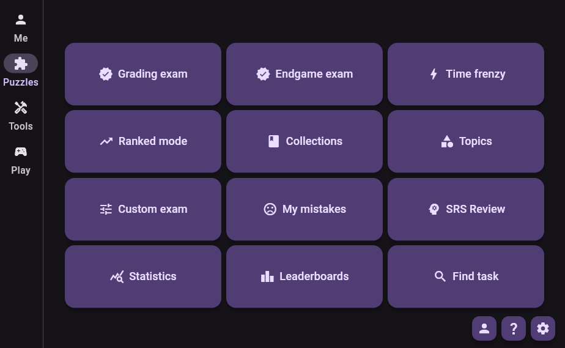
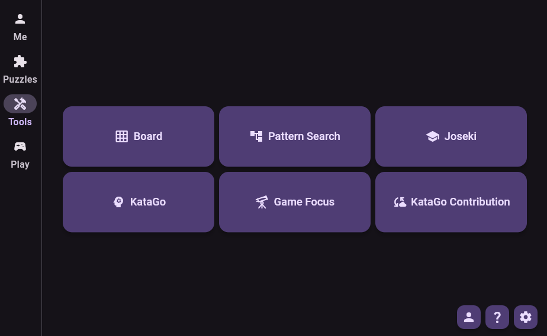
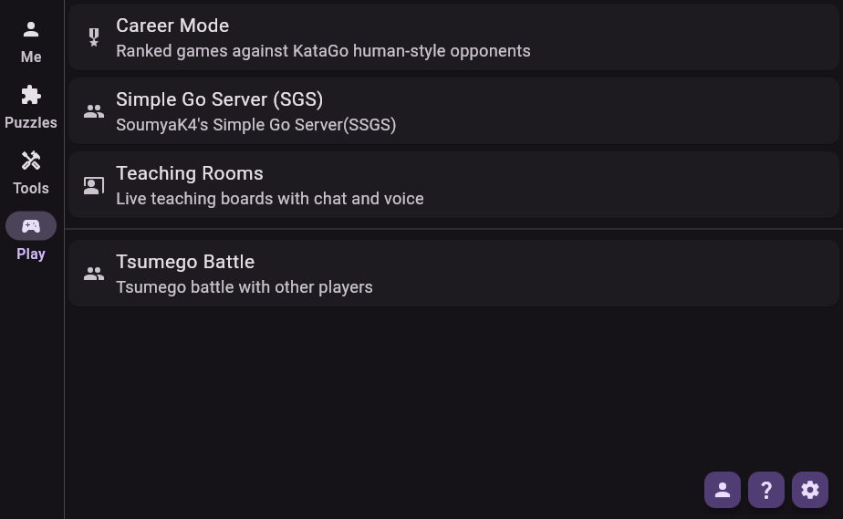
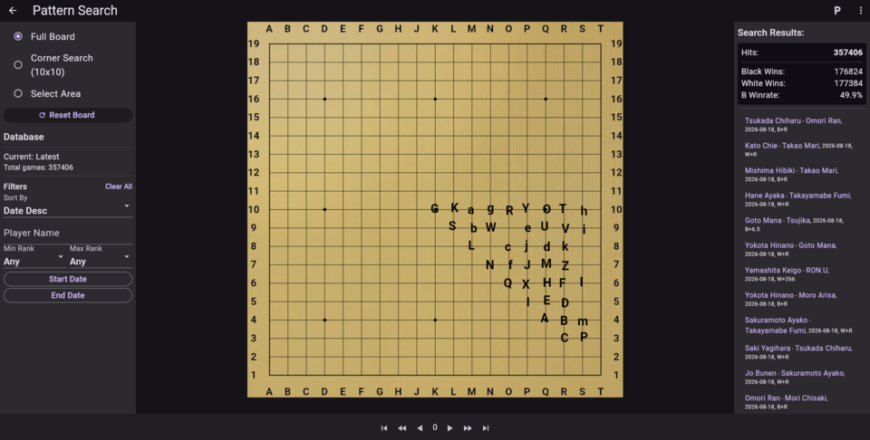
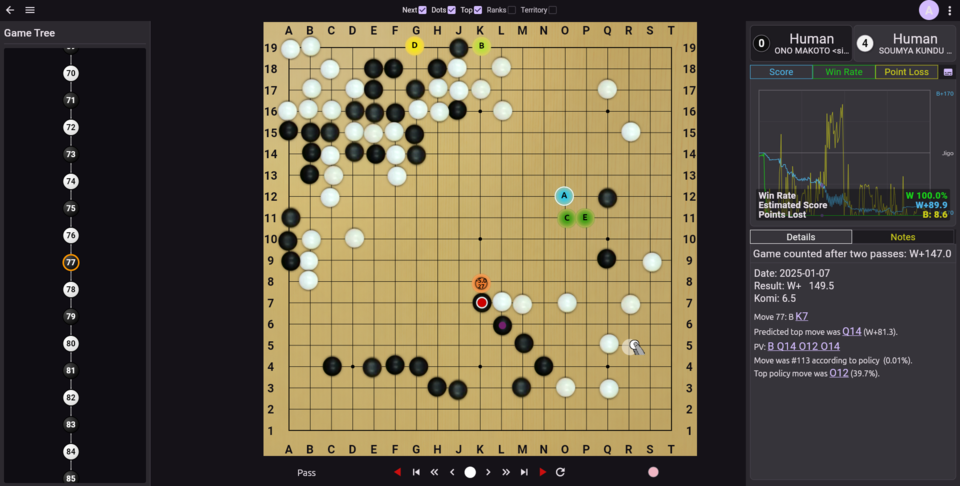
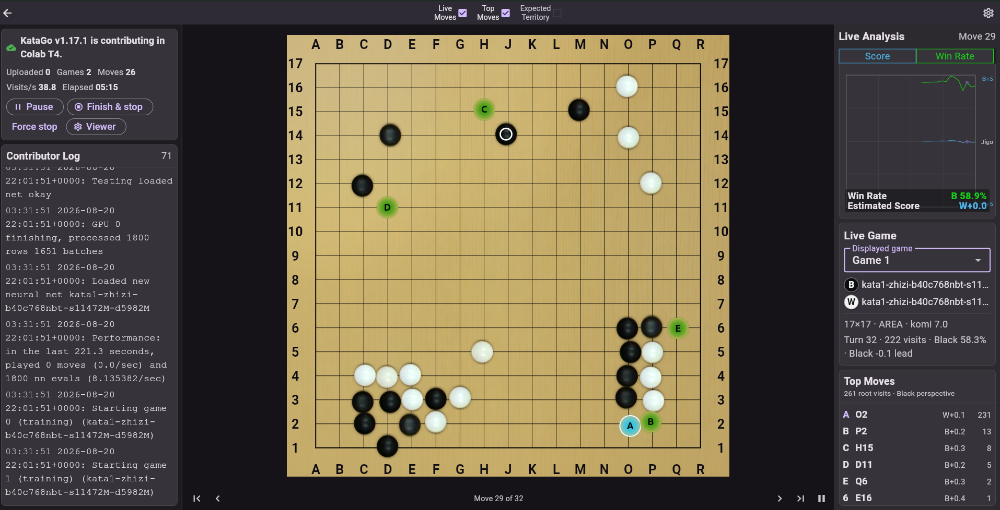

<h1 align="center">
  <picture>
    <source media="(prefers-color-scheme: dark)" srcset="./Images/header_dark.png">
    
  </picture>
</h1>
<h1 style="text-align: center;">
  <a href="./CHANGELOG.md">Changelog</a> |
  <a href="https://github.com/SoumyaK4/SWHub/releases/">Download</a> |
  <a href="https://soumyak4.in/">Other Go Projects</a>
</h1>
<div style="display: flex; justify-content: center;">
<a href="#">
  
</a>
</div>

SWHub is a local-first Go/Baduk/Weiqi studying app. 
It combines ```Tsumego Training``` modes, ```Pattern Search```, ```Joseki/Fuseki``` Explorer, ```KataGo Analysis```, ```Online Play with Variants```, ```Teaching/Review Rooms``` and ```Progress Tracking``` in one app.

## Free Cloud Katago

### For [Play/Analysis](./Docs/Free%20Cloud%20Katago/Analysis/README.md)

### For [Contribution](./Docs/Free%20Cloud%20Katago/Contribute/)

## Screenshots/Demo

<table>
  <tr>
    <td></td>
    <td></td>
    <td></td>
  </tr>
  <tr>
    <td></td>
    <td></td>
    <td></td>
  </tr>
</table>

## Feature Highlights

SWHub is organized around four destinations: **Puzzles**, **Tools**, **Play**, and **Me**. Compact layouts use bottom navigation, while wider windows use a navigation rail.

<details>
<summary>What can I do in Puzzles?</summary>

- **Grading Exam:** solve ten same-rank problems with 45 seconds per problem, eight correct answers pass the exam.
- **Endgame Exam:** the same ten-problem format using endgame positions.
- **Time Frenzy:** solve as many increasingly difficult problems as possible in three minutes, with the run ending after three mistakes.
- **Ranked Mode:** adaptive untimed solving that raises difficulty as accuracy and speed improve.
- **Collections and Topics:** work through curated books/sets or train a chosen topic, subtopic, and rank range.
- **Custom Exam:** combine selected topics, collections, rank ranges, or prior mistakes into a personal exam.
- **My Mistakes and SRS Review:** inspect missed problems and revisit them on a spaced schedule. SRS remains independent when a mistake is cleared or ignored, and problems graduate after a sustained correct streak.
- **Statistics and Leaderboards:** review recent activity, rank/type breakdowns, personal bests, and global results for supported training modes and periods.
- **Find Task:** open a task directly from its shared identifier. Management tools remain developer/debug features.

Puzzle solving also supports multiple correct variations, optional solution continuation, color/orientation randomization, always-black-to-play, Auto-Next, Count and Status problem types, Count Hard Mode, and Ghost Mode for visualization training.
</details>

<details>
<summary>What can I do in Tools?</summary>

- **Local Board:** create and edit variations on a free-play board, navigate a visual game tree, annotate SGFs, count liberties and group status, draw pen marks, and estimate Japanese-rules scores with whole-group dead/alive correction.
- **Pattern Search:** build a private Kombilo database from local 19x19 SGFs, search full-board, corner, or selected-area patterns, filter game metadata, inspect continuations, player profiles, date/win-rate statistics, and exact indexed hits, save search history and snapshots, or try Guess the Next Move. Large imports are checkpointed, invalid SGFs are skipped, and portable `.db` bundles keep the `.ps` database together with its required auxiliary files.
- **Joseki:** browse about 19,800 bundled OGS positions completely offline on a full 19x19 board. The explorer includes Joseki and Fuseki branches, pass and tenuki, official move categories and labels, board marks, descriptions, source/tag filters, and related-position or external links.
- **KataGo Analysis:** use a bundled/local process, custom command, or remote WebSocket engine on supported platforms. Review top moves, point loss, score/win-rate graphs, ownership, policy, variations, move statistics, notes, and a Performance Report with opening/midgame/endgame filters and optional HumanSL Rank(Avg.) estimates. Auto Setup handles compatible KataGo binaries and models, while advanced commands cover deeper analysis, alternatives, all-move analysis, and areas of interest.
- **Game Focus:** import complete local or supported public-account games,
  analyze them in a resumable queue, and keep the completed review offline.
  Dashboard, Profile, Drills, and Weaknesses cover source-filterable public
  rank/results charts, a cumulative HumanSL rank estimate that improves as
  analyzed games accumulate, objective phase/region/severity reporting,
  overall and phase accuracy trends, saved F3 reports, and exportable
  full-board drills with an independent schedule up to two weeks.
- **KataGo Contribution:** contribute through a compatible controller or local KataGo process and watch live games, analysis, logs, and session progress. Colab and Modal setup guides are included; the contribution Colab can persist safe cache data in Google Drive between runtimes.
</details>

<details>
<summary>What can I do in Play?</summary>

- **Career Mode:** play ranked games against rank-guided KataGo HumanSL styles,  track recent-window promotion/demotion progress and peak rank, save finished SGFs, review games, or open an unranked stronger-rank analysis board for practice.
- **SSGS:** use SWHub's built-in lobby and game client for challenges, matchmaking, chat, standard Go, team/Rengo play, and One Color, Traitor, Blind, or Phantom variants. Game settings include rules, board size, komi, and time controls; completed records can be saved as SGF or opened for analysis.
- **Tsumego Battles:** create or join a room code, configure rank/type/time ranges, chat and ready up, then solve the same synchronized problem set.
- **Teaching Rooms:** when enabled for a build, create password-protected shared boards with teacher/student roles, assigned colors and turns, chat, board annotations, scoring, and controlled voice participation.
</details>

<details>
<summary>What is on the Me page?</summary>

- Avatar and player identity, unique solved count, total problem count, and highest solved ranks for recent periods and all time.
- Personal bests, training activity, a calendar heatmap, and success rates by problem type.
- Actions to share a stats image, open the public Game Focus Profile, or sync local stats using a leaderboard username and private sync key.
</details>

## F.A.Q.

<details>
<summary>Frequently Asked Questions</summary>

### Where should I start?

Start with **Puzzles** if you want structured reading practice, **Tools** if you have a game or position to study, **Play** for live games and shared sessions, and **Me** when you want to see progress, or sync data. The in-app **Settings > FAQ** contains longer operational notes and troubleshooting.

### Which features work offline?

Bundled puzzles, Local Board, Joseki, existing Pattern Search databases, local statistics, saved SGFs, and saved Game Focus reviews work offline. Local KataGo also works offline after its executable and models are installed. Public-profile/archive imports, remote KataGo, leaderboards/sync, SSGS, Tsumego Battles, and Teaching Rooms require a network connection.

### What is the difference between My Mistakes, SRS, and Game Focus Drills?

**My Mistakes** records failed attempts. **SRS Review** schedules those for long-term repetition. **Game Focus Drills** are generated from point losses in your own analyzed games, retain the full board and KataGo answers, and use a separate short schedule that tops out at two weeks.

### How do I move a Pattern Search database?

Use Pattern Management's exported `.db` bundle. A raw `.ps` file is only one part of the database; its `.pa`, `.ps1`, `.ps2`, and other required siblings must stay together. Large bundle imports are streamed and installed through a
staged rollback-safe process.

### Where is my data, and what should I back up?

On desktop, app-managed data is under `Documents/SWHub`. Important items are `swhub_stats.db`, `game_focus.db`, the `PS` directory, saved SGFs, and KataGo files. Close SWHub before copying live databases. Use exported Pattern Search bundles for portable backups and keep your leaderboard sync key somewhere safe; it cannot be recovered if lost.

### Why is a feature missing from my build?

Feature availability varies by platform and build configuration. Local KataGo tools need a supported engine environment, and Teaching Rooms are an explicitly enabled optional feature. The ordinary app remains usable without either. And most importantly, this is a collection of tools that I combined for personal use, and shared here so others can benefit. In case you want a specefic feature, you can always contact me, but the avalilability will sadly depend on my free time.

</details>

## Feedback

- To report issues/bugs please visit [https://github.com/SoumyaK4/SWHub/issues](https://github.com/SoumyaK4/SWHub/issues)
- For other discussions hop on to [My Discord](https://discord.gg/ptjzTWU9SP) 
  - or [Computer Go Community](https://discord.gg/TMGEP5dxA)'s gui channel if its Katago related discussion. Specially if its about [https://katagotraining.org/](https://katagotraining.org/) contribution.

## License

SWHub is proprietary software; it is not open source. It is distributed under the [SWHub Non-Commercial Proprietary License](LICENSE.md), which prohibits unauthorized commercial use, monetization, modification, builds, and redistribution. Third-party components remain under their respective terms, [available here](./Docs/Licenses/).
Official SWHub copies are available only from SoumyaK4 directly or through [the official SWHub binary releases](https://github.com/SoumyaK4/WeiqiHub/releases), third-party mirrors, stores, repositories, and re-uploads are not authorized.
SWHub source code is not included in the public distribution or licensed for use.
